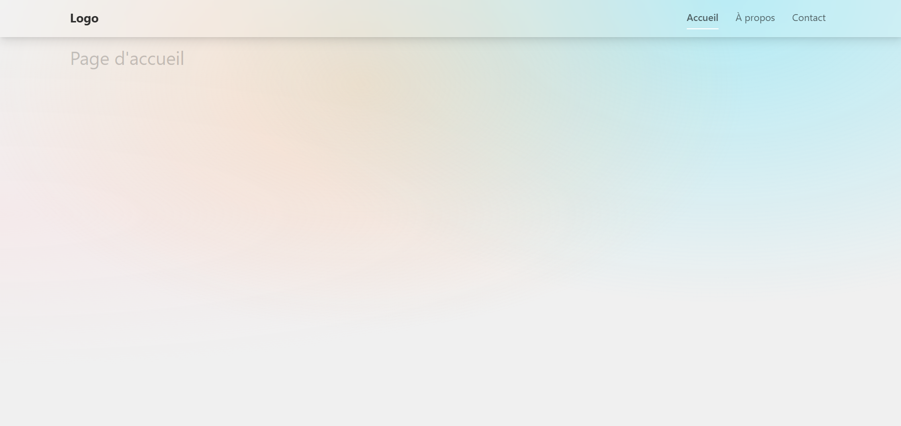

# 🍸 Menu Responsive Vue 3 - Glassmorphisme

<div align="center">
  
</div>
<div align="center">
   
</div>


## 🛠 Stack Technique

    title Technologies
    "Vue 3" : 35
    "TypeScript" : 25
    "Tailwind CSS" : 25
    "Vite" : 15

## 🚀 Guide d'installation
```bash
# 1. Cloner le projet
git clone https://github.com/dieuveilmikengue/Menu-responsive-avec-Vue-js-et-Tailwind.git

# 2. Installer les dépendances (avec choix de package manager)
npm install   

# 3. Lancer en mode développement
npm run dev

```

### Ajouter un nouveau lien :
1. Éditer le tableau dans `NavBar.vue` :
```ts
const navLinks = [
  { to: '/', text: 'Accueil', icon: '🏠' },
  { to: '/about', text: 'À propos', icon: '❓' },
  // Ajouter ici
]
```

## 📱 Points de rupture Responsive
| Breakpoint | Comportement |
|------------|--------------|
| `< 768px`  | Menu hamburger |
| `≥ 768px`  | Navigation horizontale |


## 📚 Ressources complémentaires
- [Vue Transition](https://vuejs.org/guide/built-ins/transition.html)
- [Tailwind Glassmorphism](https://tailwindcss.com/docs/backdrop-blur)

---
