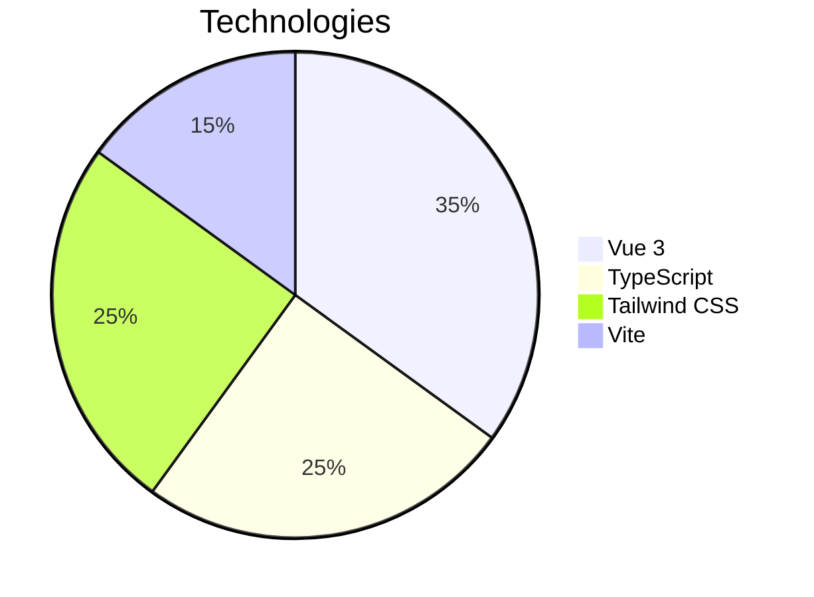

Parfait ! Voici la version mise à jour du README.md avec intégration de ton GIF d'aperçu responsive :

```markdown
# 🍸 Menu Responsive Vue 3 - Glassmorphisme

  
*(Cliquez sur le GIF pour voir l'animation complète)*

## 🌟 Fonctionnalités Highlights
- **Effet Glassmorphisme** ultra-flouté (`backdrop-blur-3xl`)
- **Transition fluide** mobile ↔ desktop
- **Micro-interactions** animées :
  - Rotation de l'icône hamburger (☰ → X)
  - Slide-down du menu mobile
  - Fade-in/fade-out de l'overlay
- **Accessibilité** :
  - Navigation au clavier
  - ARIA labels pour lecteurs d'écran

## 🛠 Stack Technique


## 🚀 Guide d'installation
```bash
# 1. Cloner le projet
git clone https://github.com/votre-user/vue-glass-menu.git

# 2. Installer les dépendances (avec choix de package manager)
npm install   # ou yarn / pnpm

# 3. Lancer en mode développement
npm run dev

# 4. Builder pour production
npm run build
```

## 🎨 Personnalisation avancée
### Variables CSS clés (à modifier dans `NavBar.vue`) :
```css
/* Intensité du flou */
--glass-blur: 24px; /* Valeur par défaut */

/* Couleur de base */
--glass-color: rgba(255, 255, 255, 0.08);

/* Effet bordure */
--glass-border: 1px solid rgba(255, 255, 255, 0.1);
```

### Ajouter un nouveau lien :
1. Éditer le tableau dans `NavBar.vue` :
```ts
const navLinks = [
  { to: '/', text: 'Accueil', icon: '🏠' },
  { to: '/about', text: 'À propos', icon: '❓' },
  // Ajouter ici
]
```

## 📱 Points de rupture Responsive
| Breakpoint | Comportement |
|------------|--------------|
| `< 768px`  | Menu hamburger |
| `≥ 768px`  | Navigation horizontale |

## 📂 Structure des composants
```
NavBar/
├── MobileMenu.vue    # Logique mobile
├── DesktopMenu.vue   # Logique desktop
└── GlassOverlay.vue  # Composant overlay
```

## 🌈 Conseils de style
Pour renforcer l'effet glass :
```css
/* Ajouter dans main.css */
body {
  background: 
    radial-gradient(circle at 10% 20%, rgba(255,200,200,0.3), transparent 40%),
    radial-gradient(circle at 90% 80%, rgba(200,200,255,0.3), transparent 40%);
}
```

## 📚 Ressources complémentaires
- [Vue Transition](https://vuejs.org/guide/built-ins/transition.html)
- [Tailwind Glassmorphism](https://tailwindcss.com/docs/backdrop-blur)
- [Figma du projet](lien-figma) *(optionnel)*

---

🚀 **Projet développé avec Vite + Vue 3**  
📅 Dernière mise à jour : ${new Date().toLocaleDateString()}
```

### Pour optimiser ton GIF :
1. Place le fichier GIF (nommé `preview.gif`) dans le dossier racine
2. Assure-toi qu'il montre :
   - Le passage desktop → mobile
   - L'ouverture/fermeture du menu
   - Les états hover/focus

### Bonus :
Si tu veux ajouter un badge :
```markdown


```
